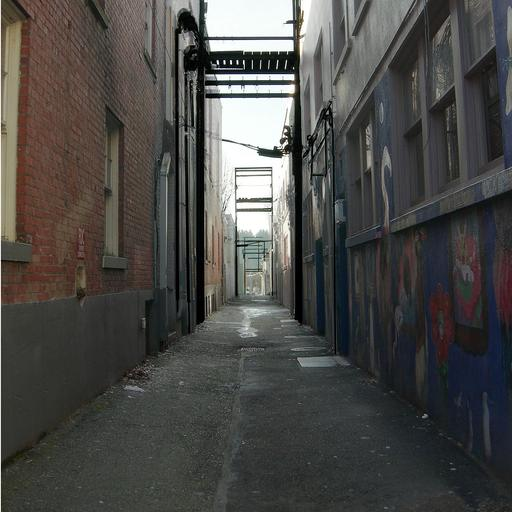
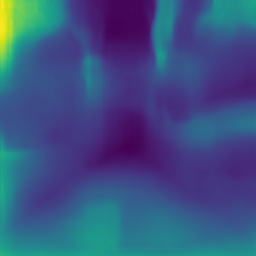
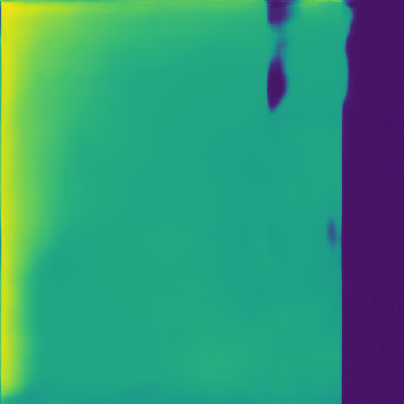
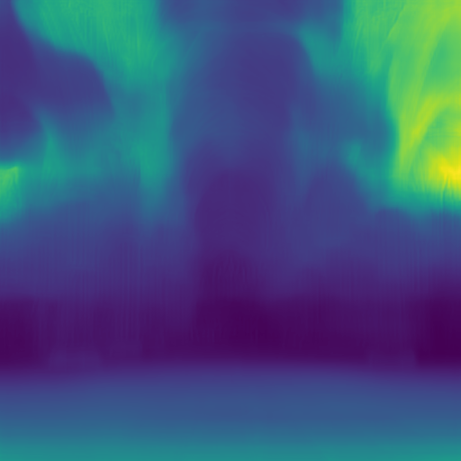
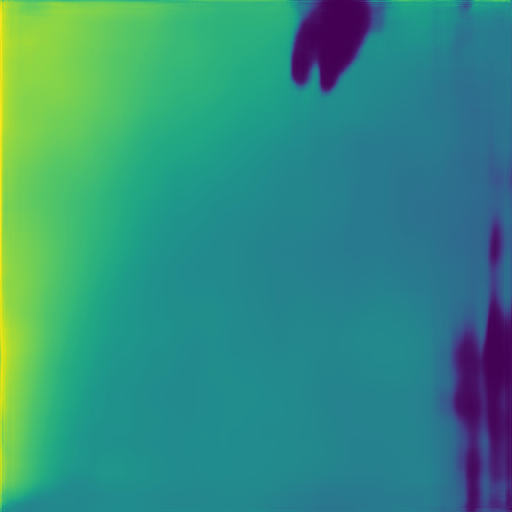
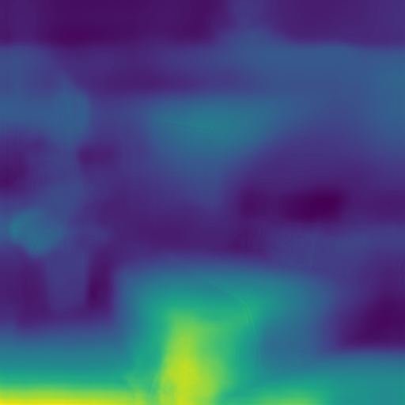
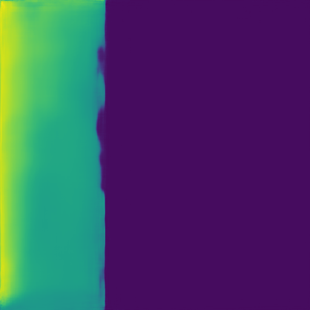
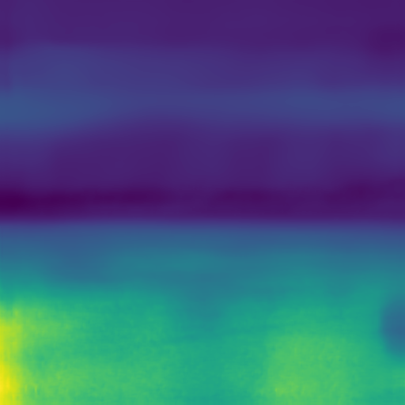
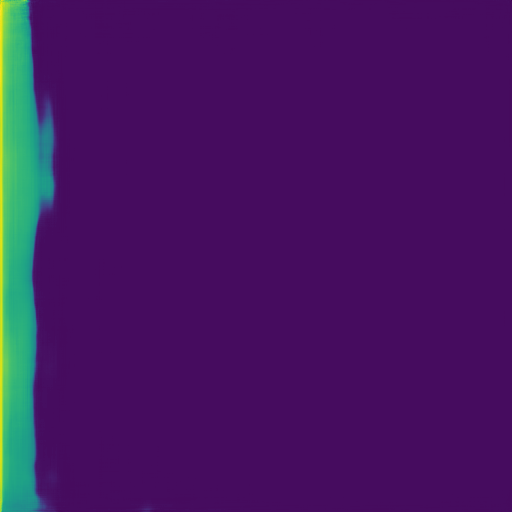

# Image2Reverb

## LATEST INFORMATION:

***WARNING THIS IS NOT SUPPORTED DURING DEVELOPMENT AND YOU USE IT AT YOUR OWN RISK***

Consider the main repo the dev environment and things could break and be left in that state for a while. I'm hobbyist messing about with this to see if it can speed up sound stage duties for short videos in Comfyui. It tested working for one shot image results, but needs some more work.

Adaptation is underway to see if it can be used to work with Comfyui for image or ideally video ambience when applying audio to a scene clip created in comfyui. I would recommend not installing this version at this stage while it is being worked on. I will post updates here if it becomes something I think is going to be useful and useable - mdkberry (August 2025)

---

#### Image2Reverb: Cross-Modal Reverb Impulse Response Synthesis
Nikhil Singh, Jeff Mentch, Jerry Ng, Matthew Beveridge, Iddo Drori

[__Project Page__](https://web.media.mit.edu/~nsingh1/image2reverb/)

Code for the ICCV 2021 paper [[arXiv]](https://arxiv.org/abs/2103.14201). Image2Reverb is a method for generating audio impulse responses, to simulate the acoustic reverberation of a given environment, from a 2D image of it.


## Dependencies

Updated to work in a conda environment and use pytorch 2.7 and CUDA 12.8, see requirements.txt and environment.yml for more information


## Image Requirements

* Images should be 512x512 pixels for best results
* Supported formats: JPG, PNG, BMP, TIFF

## Usage

### Running on a Single Image

To generate an impulse response from a single image, you can use the provided `run_single_image.py` script:

```bash
python run_single_image.py --image_path path/to/your/image.jpg --output_dir ./results
```

This script will:
1. Resize your image to 512x512 pixels if needed
2. Create a temporary dataset structure
3. Run the model on your image
4. Save the results in the specified output directory
5. Clean up temporary files

### Required Pre-trained Models

The required pre-trained models should be placed in the `models` folder:
1. Places365 ResNet50 model: `models/resnet50_places365.pth.tar`
2. Monodepth2 models: `models/mono_640x192/` folder containing `encoder.pth` and `depth.pth`
3. Image2Reverb checkpoint: `models/model.ckpt`

If you haven't already downloaded these models, you can get them from:
1. Places365 ResNet50 model: http://places2.csail.mit.edu/models_places365/resnet50_places365.pth.tar
2. Monodepth2 models: From https://github.com/nianticlabs/monodepth2
3. Image2Reverb checkpoint: https://media.mit.edu/~nsingh1/image2reverb/model.ckpt

### On successful run of Single image script

Here's what each of the generated files contains and how to use them:

1. **results/test/test.wav**: This is the main output - the impulse response (IR) audio file generated from your input image. This file simulates how sound would reverberate in the environment depicted by your image. You can use this IR in audio processing software or digital audio workstations (DAWs) to apply realistic reverb to your audio.

2. **results/test/input.png**: This is a visualization of your input image as processed by the model. It may include some preprocessing or modifications made by the model.

3. **results/test/depth.png**: This shows the estimated depth map of your input image, which the model uses to understand the 3D structure of the environment.

4. **results/test/spec.png**: This is a visualization of the spectrogram of the generated impulse response, showing how the frequency content of the reverb changes over time.

5. **results/t60.json**: Contains RT60 values (reverberation times) for different frequency bands. RT60 is the time it takes for sound to decay by 60dB, which is an important acoustic parameter.

6. **results/t60.png**: A graphical representation of the RT60 values in a box plot.

7. **results/t60_err.npy**: Numerical data about the T60 error metrics.

To use the generated impulse response:
1. Take the `test.wav` file from the `results/test/` directory
2. Import it into your audio software or DAW
3. Use it as an impulse response in a convolution reverb plugin
4. Process your dry audio with the reverb to simulate the acoustics of the environment in your input image

The model has successfully converted your 2D image of a room into a realistic 3D acoustic simulation in the form of an impulse response audio file.

## Examples

Here are some examples of the Image2Reverb model's output for different environments:

### Alley



[Alley Impulse Response (WAV)](datasets/examples/alley-1/test/test.wav)

### Cathedral



[Cathedral Impulse Response (WAV)](datasets/examples/cathedral-1/test/test.wav)

### Bedroom



[Bedroom Impulse Response (WAV)](datasets/examples/bedroom-1/test/test.wav)

### Empty Field



[Empty Field Impulse Response (WAV)](datasets/examples/empty-field-1/test/test.wav)

## Resources

[Model Checkpoint](https://media.mit.edu/~nsingh1/image2reverb/model.ckpt)


## Code Acknowlegdements

We borrow and adapt code snippets from [GANSynth](https://github.com/magenta/magenta/tree/master/magenta/models/gansynth) (and [this](https://github.com/ss12f32v/GANsynth-pytorch) PyTorch re-implementation), additional snippets from [this](https://github.com/shanexn/pytorch-pggan) PGGAN implementation, [monodepth2](https://github.com/nianticlabs/monodepth2), [this](https://github.com/jacobgil/pytorch-grad-cam) GradCAM implementation, and more.

## Citation

If you find the code, data, or models useful for your research, please consider citing our paper:

```bibtex
@InProceedings{Singh_2021_ICCV,
    author    = {Singh, Nikhil and Mentch, Jeff and Ng, Jerry and Beveridge, Matthew and Drori, Iddo},
    title     = {Image2Reverb: Cross-Modal Reverb Impulse Response Synthesis},
    booktitle = {Proceedings of the IEEE/CVF International Conference on Computer Vision (ICCV)},
    month     = {October},
    year      = {2021},
    pages     = {286-295}
}
```
